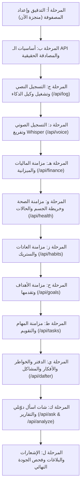

# مطابقة الوظائف بين تطبيق دوّنلي الأصلي وتطبيق فلاتر (Flutter Functionality Parity Matrix)

> **تاريخ التدقيق:** 15 سبتمبر 2026  
> **الهدف:** توثيق ومقارنة كافة الوظائف وقواعد الأعمال بين مستودع دوّنلي الأصلي (Node.js + SQLite + OpenAI Agent) وبين تطبيق Flutter الحالي، مع الحفاظ الصارم على واجهة المستخدم المعتمدة حالياً دون أي تعديل شكلي.

---

## 1. مصفوفة مقارنة الوظائف (Functionality Parity Matrix)

| الوظيفة في المشروع الأصلي (Original Feature) | ملفات التنفيذ في الويب / الباكند (Original Implementation) | حالة فلاتر الحالية (Flutter Status) | موقع التنفيذ في فلاتر (Flutter Location) |
|---|---|---|---|
| **المصادقة وتسجيل الدخول (Authentication)** | `src/server.js` (POST /api/login, /api/me), `src/db.js` | جزئي (Partial) - يتصل بـ /api/login و/api/me مع توكن Bearer، لكن مع fallback لمستخدم محلي | `lib/providers/auth_provider.dart`, `lib/core/api_client.dart` |
| **التسجيل النصي وترتيب اليوميات (Text Logging / Agent)** | `src/server.js` (POST /api/log), `src/agent.js` (`runAgent`), `src/openai.js` | مفقود (Missing) - الكومبوزر لا يرسل لـ /api/log لتشغيل الـ AI Agent | `lib/core/design_system/composer_card.dart`, `lib/providers/data_provider.dart` |
| **التسجيل الصوتي وتفريغ الذكاء (Voice Logging & Transcription)** | `src/server.js` (POST /api/voice), `src/openai.js` (`transcribe`), `src/agent.js` | جزئي (Partial) - يسجل صوت محلياً لكن لا يرفعه لـ /api/voice لتفريغه ومعالجته بالوكيل | `lib/providers/voice_provider.dart`, `lib/widgets/voice_modal.dart` |
| **وكيل الذكاء واستدعاء الأدوات (AI Agent & Tool Calling)** | `src/agent.js` (17 Tools: save_journal, log_finance, log_health, etc.) | مفقود في العميل (Missing in Client) - التطبيق لم يكن يرسل للباكند لتنفيذ الأدوات | يتطلب ربط /api/log و/api/voice وتحديث الواجهة بنتائج receipts |
| **شات اسأل دوّنلي السياقي (Contextual Ask Chat)** | `src/server.js` (POST /api/ask, GET /api/ask/history), `src/db.js` | جزئي (Partial) - واجهة الشات مبنية بالكامل لكن ChatProvider يستخدم ردوداً محلية وهمية | `lib/screens/chat_screen.dart`, `lib/providers/chat_provider.dart` |
| **المكالمة الصوتية المباشرة (Voice Call / Turn-taking)** | `src/server.js` (POST /api/ask/voice, POST /api/tts), `src/openai.js` | جزئي (Partial) - زر وواجهة المكالمة جاهزة لكنها غير متصلة بـ /api/ask/voice و/api/tts | `lib/screens/chat_screen.dart` |
| **الماليات والمصاريف (Finance)** | `src/server.js` (GET/POST /api/finance, PUT /api/finance/:id), `src/db.js` | جزئي (Partial) - إدارة المصاريف محلياً في SharedPreferences بدل استعلام وحفظ السيرفر | `lib/screens/tabs/finances_tab.dart`, `lib/providers/data_provider.dart` |
| **ميزانية وهدف الشهر (Finance Budget & Goal)** | `src/server.js` (GET/PUT /api/finance-budget), `src/db.js` | مفقود (Missing) - غير مربوط بـ /api/finance-budget | `lib/screens/tabs/finances_tab.dart` |
| **الأصول وصافي الثروة (Assets & Market Rates)** | `src/server.js` (GET/POST /api/assets, POST /api/assets/refresh-prices) | جزئي (Partial) - واجهة وحسابات حية لكن التخزين محلي وليس على السيرفر | `lib/screens/tabs/assets_tab.dart`, `lib/providers/data_provider.dart` |
| **سجلات الصحة والأعراض (Health Records)** | `src/server.js` (GET/POST /api/health, PUT/DELETE /api/health/:id), `src/db.js` | جزئي (Partial) - الواجهة جاهزة لكن التخزين محلي بدل /api/health | `lib/screens/tabs/health_tab.dart`, `lib/providers/data_provider.dart` |
| **خريطة الجسم التفاعلية (Body Map)** | `public/app.js` (#bodySvg), `src/server.js` (body_region) | كامل (Complete UI) - تم رسم خريطة الجسم ومناطقها، تحتاج فقط لربط البيانات القادمة من السيرفر | `lib/core/design_system/daftar_body_map.dart` |
| **متابعة الحالات الصحية المزمنة (Health Conditions)** | `src/server.js` (GET /api/conditions, PUT /api/conditions/:id/close), `src/db.js` | مفقود (Missing) - لا يتم جلب الحالات أو إغلاقها عبر السيرفر | `lib/screens/tabs/health_tab.dart` |
| **تقرير الطبيب للأعراض (Doctor Report)** | `src/server.js` (GET /api/conditions/:id/report), `src/openai.js` | مفقود (Missing) - لا يتم استدعاء تقرير الطبيب التلخيصي | `lib/screens/tabs/health_tab.dart` |
| **العادات والتكرار (Habits Tracking & Streaks)** | `src/server.js` (GET/POST /api/habits, POST/DELETE /api/habits/:id/log) | جزئي (Partial) - التبديل والستريك محلي، غير متصل بـ /api/habits/:id/log | `lib/screens/tabs/habits_tab.dart`, `lib/providers/data_provider.dart` |
| **الأهداف وتقدمها (Goals Tracking)** | `src/server.js` (GET/POST /api/goals, PUT /api/goals/:id/current, logs) | جزئي (Partial) - الواجهة جاهزة لكن الحفظ محلي بدل /api/goals | `lib/screens/tabs/goals_tab.dart`, `lib/providers/data_provider.dart` |
| **المهام والتقويم (Tasks & Calendar)** | `src/server.js` (GET/POST /api/tasks, PUT /api/tasks/:id/done, DELETE) | جزئي (Partial) - التقويم والمهام والمهام العامة مكتملة شكلياً، لكن التخزين محلي | `lib/screens/tabs/tasks_tab.dart`, `lib/providers/data_provider.dart` |
| **يوميات الدفتر (Journal Entries)** | `src/server.js` (GET /api/entries, PUT/DELETE /api/entries/:id), `src/db.js` | جزئي (Partial) - التدوين محلي بدل /api/entries | `lib/screens/tabs/dafter_tab.dart`, `lib/providers/data_provider.dart` |
| **عصف الخواطر (Thoughts / Brainstorm)** | `src/server.js` (GET/POST /api/thoughts, POST /api/thoughts/voice) | جزئي (Partial) - تبويب الخواطر في الدفتر يحفظ محلياً بدل /api/thoughts | `lib/screens/tabs/dafter_tab.dart` |
| **الأفكار والخطط (Ideas & Plans)** | `src/server.js` (GET/POST /api/ideas, PUT /api/ideas/:id/status) | جزئي (Partial) - تبويب الأفكار في الدفتر يحفظ محلياً بدل /api/ideas | `lib/screens/tabs/dafter_tab.dart` |
| **المشاكل والهموم (Problems)** | `src/server.js` (GET/POST /api/problems, PUT /api/problems/:id/status) | جزئي (Partial) - تبويب المشاكل في الدفتر يحفظ محلياً بدل /api/problems | `lib/screens/tabs/dafter_tab.dart` |
| **ذاكرة دوّنلي الثابتة (Profile Facts / Memory)** | `src/server.js` (GET/POST /api/profile, DELETE /api/profile/:id), `src/db.js` | مفقود (Missing) - شاشة "دوّنلي يعرف إيه عنك" بها عنصر نائب | `lib/screens/home_screen.dart` |
| **مركز الملفات وتصنيف الرؤية (Files Center & Vision Classification)** | `src/server.js` (GET/POST /api/files, GET /api/files/:id/raw, DELETE) | مفقود (Missing) - تبويب الملفات به عنصر نائب | `lib/screens/home_screen.dart` |
| **تفاصيل تكلفة الذكاء الاصطناعي (AI Usage & Cost)** | `src/server.js` (GET /api/my-usage, GET /api/my-usage/details) | مفقود (Missing) - التبويب غير مفعّل على بيانات السيرفر | `lib/screens/home_screen.dart` |
| **التحليل الأسبوعي والتقرير الشامل (Analyze & Unified Report)** | `src/server.js` (GET /api/analyze, GET /api/report), `src/openai.js` | مفقود (Missing) - زر "حلّلي أيامي" غير مربوط بـ /api/analyze | `lib/screens/tabs/dafter_tab.dart` |
| **الإشعارات والتنبيهات (Notifications)** | `src/server.js` (GET /api/notifications, POST /api/notifications/read) | جزئي (Partial) - مودال الإشعارات مبني شكلياً، لكنه يعرض قائمة فارغة ثابتة | `lib/widgets/notif_modal.dart` |
| **الإبلاغ عن المشاكل (Bug Reporting)** | `src/server.js` (POST /api/report), `src/config.js` | مفقود (Missing) - يفتح دايلوج بسيط بدون استدعاء /api/report لإرسال البلاغ | `lib/screens/home_screen.dart` |
| **المتتبعات الرقمية اليومية (Daily Metrics)** | `src/server.js` (GET/POST /api/metrics, POST /api/metrics/:id/day), `src/db.js` | مفقود (Missing) - لم يتم تضمين تتبع الأرقام المباشرة (مثل الوزن وعدد الخطوات) | `lib/providers/data_provider.dart` |
| **إشعارات الـ Push المجدولة (Scheduled Push / Check-ins)** | `src/scheduler.js`, `src/push.js` | مفقود على الموبايل (Missing Native Push) - السيرفر يجدول check-in وتذكير 10م، لكن الموبايل يحتاج آلية استلام أو Local Notifications | `lib/services/` |

---

## 2. ما هو موجود بالفعل في فلاتر (What Currently Exists in Flutter)

1. **الهوية البصرية ونظام التصميم المعتمد (100% Complete Visual Identity)**:
   - كافة الشاشات والتابات والمودالات تستخدم الخطوط والألوان والبطاقات المرسومة يدوياً (`SketchCard`, `SketchButton`, `SketchChip`, `Lemonada`, `Tajawal`).
   - الرسوم التوضيحية وشعار SVG وأيقونات العوالم وخريطة الجسم (`DaftarBodyMap`).
2. **البنية الأساسية للشبكة والمصادقة (`ApiClient`)**:
   - كلاس `ApiClient` يدعم Token-based auth وBase URL قابل للتغيير للاتصال بـ `localhost:3000` أو الـ Emulator `10.0.2.2:3000` أو أي سيرفر إنتاج.
   - دعم التوابع: `get`, `post`, `put`, `delete`, `uploadVoice`.
3. **مزودات الحالة (State Management with Provider)**:
   - `AuthProvider`: يفحص الجلسة مع `/api/me` ويدعم تسجيل الدخول.
   - `DataProvider`: يحتوي على كائنات النماذج (`TaskModel`, `HabitModel`, `FinanceItemModel`, `HealthItemModel`, `GoalItemModel`, `EntryItemModel`, `AssetItemModel`).
   - `VoiceProvider`: تسجيل الصوت عبر الميكروفون وحساب التوقيت وإنتاج ملفات `m4a`.
   - `ChatProvider`: إدارة سجل المحادثات والرسائل.

---

## 3. ما هو مفقود وناقص (What is Missing)

1. **استدعاء الـ AI Agent الفعلي في التدوين (`/api/log`)**:
   - في الويب: عند كتابة نص والضغط على "رتّبها لي"، يُرسل النص إلى `/api/log`؛ فيقوم الوكيل `runAgent` باستخراج المهام والمصاريف والعادات والأهداف تلقائياً وإرجاع الرد والإيصالات (`receipts`).
   - في فلاتر: الكومبوزر في الصفحة الرئيسية وصفحة الدفتر يحفظ النص فقط دون استدعاء الوكيل لاستخراج البيانات.
2. **ربط التسجيل الصوتي بالخادم (`/api/voice`)**:
   - في الويب: المتصفح يرسل الصوت كـ raw bytes إلى `/api/voice`؛ فيقوم السيرفر بتفريغه عبر Whisper وتمريره للوكيل وحفظ البيانات مباشرة في SQLite.
   - في فلاتر: `VoiceProvider.stopAndSend` يحفظ نصاً تجريبياً محلياً فقط ولا يرسل الصوت للباكند.
3. **ربط شات "اسأل دوّنلي" بمحرك البحث الحقيقي (`/api/ask`)**:
   - في الويب: الشات يتصل بـ `/api/ask` ويبحث في سياق اليوميات والماليات والأهداف الحقيقية للشخص المخزنة في SQLite ويحفظ سجل المحادثة في جدول `ask_messages`.
   - في فلاتر: `ChatProvider` يرد بردود نصية ثابتة محاكية ولا يتصل بـ `/api/ask`.
4. **تزامن بيانات العوالم الأربعة مع السيرفر بدلاً من التخزين المحلي المؤقت**:
   - في فلاتر: `DataProvider` حالياً يقرأ ويكتب على `LocalStorageService` (ملف JSON محلي) بدلاً من استدعاء نقاط النهاية:
     - `/api/finance` (جلب وإضافة وحذف المصاريف)
     - `/api/health` (جلب وإضافة وحذف السجلات الصحية)
     - `/api/habits` و `/api/habits/:id/log` (تسجيل وإلغاء تسجيل العادات)
     - `/api/goals` و `/api/goals/:id/current` (تحديث نسب تقدم الأهداف)
     - `/api/tasks` و `/api/tasks/:id/done` (إتمام وإعادة فتح المهام)
     - `/api/assets` و `/api/assets/refresh-prices` (إدارة الأصول وأسعار السوق)
5. **جلب وعرض الإشعارات الحقيقية (`/api/notifications`)**:
   - نافذة الإشعارات تعرض نصاً ثابتاً "لا توجد إشعارات" بدلاً من قراءة جدول `notifications` ووضع علامة "مقروء" عبر `/api/notifications/read`.
6. **زر "حلّلي أيامي" والتحليلات (`/api/analyze`)**:
   - استدعاء نموذج التحليل التلخيصي للفترة الزمنية المحددة.
7. **إرسال بلاغات المشاكل الحقيقية (`/api/report`)**:
   - ربط نافذة "بلّغ عن مشكلة" بنقطة النهاية `/api/report` لتمريرها لنظام البلاغات.
8. **ذاكرة المستخدم الثابتة (`/api/profile`)**:
   - عرض وإضافة المعلومات الثابتة التي يتذكرها دوّنلي عن المستخدم.

---

## 4. ما هو منفّذ جزئياً (What is Partially Implemented)

1. **نظام المصادقة (`AuthProvider`)**:
   - الاتصال بـ `/api/login` و`/api/me` مكتوب ومطابق، ولكنه كان يحتوي على fallback فوري ينشئ جلسة محلية وهمية حتى لو فشل الاتصال، مما يحجب خطأ عدم الاتصال بالسيرفر.
2. **الواجهات التفاعلية (Screens UI)**:
   - شاشات المهام، العادات، الأهداف، الفلوس، الأصول، الدفتر، والشات مكتملة التصميم والأزرار بنسبة 100% ومطابقة للويب، لكن منطق الإرسال والاستقبال يحتاج التحويل من `local_storage` إلى `api_client`.
3. **المكالمة الصوتية (`Ask Voice Call`)**:
   - زر المكالمة والواجهة التفاعلية متوفران في الشات، ويحتاجان الربط مع `/api/ask/voice` و`/api/tts`.

---

## 5. الملفات المسؤولة في المشروع الأصلي (Original Source Implementation Files)

| الوظيفة المطلوبة | الملف المسؤول في الباكند | الملف المسؤول في الفرونت إند الأصلي |
|---|---|---|
| معالجة النصوص واستدعاء الأدوات | `src/agent.js` (`runAgent`) | `public/app.js` (`logForm.onsubmit`) |
| تفريغ الصوت وتحليله | `src/server.js` (خط 1017), `src/openai.js` | `public/app.js` (`stopRec`, `uploadAudio`) |
| محادثة اسأل دوّنلي | `src/server.js` (خط 821), `src/openai.js` | `public/app.js` (`renderAsk`, `sendAsk`) |
| المصاريف والميزانية | `src/server.js` (خط 695, 1257), `src/db.js` | `public/app.js` (`renderFinance`) |
| السجلات الصحية | `src/server.js` (خط 700, 1276), `src/db.js` | `public/app.js` (`renderHealth`) |
| العادات والستريك | `src/server.js` (خط 725, 1286), `src/db.js` | `public/app.js` (`renderHabits`) |
| الأهداف وتقدمها | `src/server.js` (خط 705, 1308), `src/db.js` | `public/app.js` (`renderGoals`) |
| المهام والتقويم | `src/server.js` (خط 751, 758), `src/db.js` | `public/app.js` (`renderTasksPage`) |
| اليوميات والخواطر والأفكار والمشاكل | `src/server.js` (خط 690, 783, 802, 1048) | `public/app.js` (`renderDafter`) |
| الأصول وأسعار السوق | `src/server.js` (خط 1189, 1208) | `public/app.js` (`renderAssetsPage`) |
| الإشعارات | `src/server.js` (خط 674, 682), `src/push.js` | `public/app.js` (`renderNotifsModal`) |
| التقارير والتحليل | `src/server.js` (خط 1091, 1108), `src/report.js` | `public/app.js` (`analyzeBtn`) |

---

## 6. نقاط النهاية المطلوبة في API (Required API Endpoints)

| المسار (Endpoint) | الطريقة (Method) | الغرض وحمولة البيانات (Purpose & Payload) |
|---|---|---|
| `/api/login` | POST | مصادقة المستخدم: `{ email, password, remember }` |
| `/api/me` | GET | جلب بيانات المستخدم الحالي وصلاحياته (is_owner) |
| `/api/log` | POST | تشغيل الوكيل على النص: `{ text }` -> يرجع `{ reply, receipts }` |
| `/api/voice` | POST | رفع ملف الصوت الخام -> يرجع `{ transcript, reply, receipts }` |
| `/api/ask` | POST | سؤال الشات: `{ messages, scope, date, fast }` -> يرجع `{ reply }` |
| `/api/ask/history` | GET / DELETE | جلب أو مسح سجل محادثات اسأل دوّنلي |
| `/api/ask/voice` | POST | تسجيل صوتي لسؤال في الشات |
| `/api/tts` | POST | تحويل نص رد الذكاء إلى صوت MP3: `{ text }` |
| `/api/finance` | GET / POST | جلب المصاريف أو إضافة عملية: `{ amount, direction, category, note, date }` |
| `/api/finance/:id` | PUT / DELETE | تعديل أو حذف معاملة مالية |
| `/api/finance-budget` | GET / PUT | جلب أو تعديل ميزانية وهدف الشهر: `{ month, budget, goal }` |
| `/api/health` | GET / POST | جلب أو إضافة سجل صحي: `{ category, detail, bodyRegion, entryDate }` |
| `/api/health/:id` | PUT / DELETE | تعديل أو حذف سجل صحي |
| `/api/habits` | GET / POST | جلب أو إنشاء عادة: `{ title, kind, emoji }` |
| `/api/habits/:id/log` | POST / DELETE | تسجيل أو إلغاء إنجاز العادة لتاريخ محدد: `{ date }` |
| `/api/goals` | GET / POST | جلب أو إنشاء هدف: `{ title, target, unit, deadline }` |
| `/api/goals/:id/current` | PUT | تحديث القيمة الحالية للهدف: `{ current }` |
| `/api/tasks` | GET / POST | جلب أو إضافة مهمة: `{ title, dueDate, dueTime, note }` |
| `/api/tasks/:id/done` | PUT | تعليم المهمة كمنجزة |
| `/api/tasks/:id/reopen` | PUT | إعادة فتح المهمة |
| `/api/tasks/:id` | DELETE | حذف المهمة |
| `/api/entries` | GET | جلب تدوينات اليوميات |
| `/api/entries/:id` | PUT / DELETE | تعديل أو حذف تدوينة |
| `/api/thoughts` | GET / POST / DELETE | جلب أو إضافة أو حذف خاطرة حرة |
| `/api/ideas` | GET / POST / PUT | جلب أو إضافة أو تغيير حالة فكرة |
| `/api/problems` | GET / POST / PUT | جلب أو إضافة أو تغيير حالة مشكلة |
| `/api/assets` | GET / POST | جلب الأصول وأسعار السوق أو إضافة أصل |
| `/api/assets/:id` | PUT / DELETE | تعديل أو حذف أصل |
| `/api/assets/refresh-prices` | POST | تحديث أسعار الذهب والعملات اللحظية من السوق |
| `/api/notifications` | GET | جلب إشعارات المستخدم والتذكيرات |
| `/api/notifications/read` | POST | تعليم الإشعارات كمقروءة: `{ id }` أو `{}` للكل |
| `/api/analyze` | GET | تحليل اليوميات لعدد أيام محدد: `?days=7` |
| `/api/report` | POST | إرسال بلاغ عن مشكلة للنظام: `{ message, page }` |

---

## 7. التوافق والاختلافات بين الويب وتطبيق فلاتر (Web vs Flutter Nuances)

1. **صيغة الصوت في التسجيل**:
   - الويب يسجل عبر `MediaRecorder` بصيغة `audio/webm;codecs=opus` أو `audio/ogg`.
   - في Flutter: حزمة `record` على أندرويد تسجل افتراضياً بصيغة `m4a` (AAC) أو `wav`.
   - التوافق مع الباكند: خادم Node.js في `src/server.js` يعتمد `ext = (req.headers["content-type"] || "").includes("ogg") ? "ogg" : "webm"`. لضمان تشغيل ملفات `m4a` أو `wav` عبر Whisper على السيرفر بدون خطأ، يجب إما:
     - تسجيل الصوت في Flutter بصيغة متوافقة (أو تمرير `Content-Type: audio/m4a` والسماح لـ `src/server.js` باكتشاف الامتداد بدقة).
2. **إشعارات الموبايل المجدولة (Push vs Local Notifications)**:
   - الويب يستخدم `Web Push (VAPID)`.
   - في Flutter: على أجهزة أندرويد وiOS، الإشعارات داخل التطبيق (Notification Bell) تتطابق 100% مع الويب عبر استدعاء `/api/notifications`. بالنسبة لتذكيرات المهام في موعدها وتذكير المساء، يمكن استهلاك قائمة الإشعارات والتذكيرات من السيرفر أو فحص المهام التي حان موعدها دورياً.
3. **استهلاك البيانات دون اتصال (Offline-First vs Live-API)**:
   - الويب الأصلي يحفظ التوكن في `localStorage` ويعتمد على السيرفر كمرجع نهائي للحقيقة مع وجود طبقة `localApi` احتياطية فقط عند غياب السيرفر.
   - تطبيق Flutter يجب أن يعتمد على نفس المبدأ: إرسال الطلبات إلى السيرفر الحقيقي دائماً، وتحديث الواجهة مباشرة من البيانات القادمة من السيرفر، مع الاحتفاظ بـ cache محلي للقراءة السريعة.

---

## 8. خطة التنفيذ الموصى بها (Recommended Implementation Roadmap)

وفقاً للتسلسل الدقيق المحدد في تعليمات المرحلة الثالثة، سيتم العمل خطوة بخطوة دون المساس بالواجهة المعتمدة:

---

> **ملاحظة تأكيدية:**  
> تم الحفاظ على كافة عناصر وتنسيقات واجهة Flutter الحالية المعتمدة (`Approved UI`) بالكامل دون أي مساس بشكلها أو خطوطها أو ألوانها.
